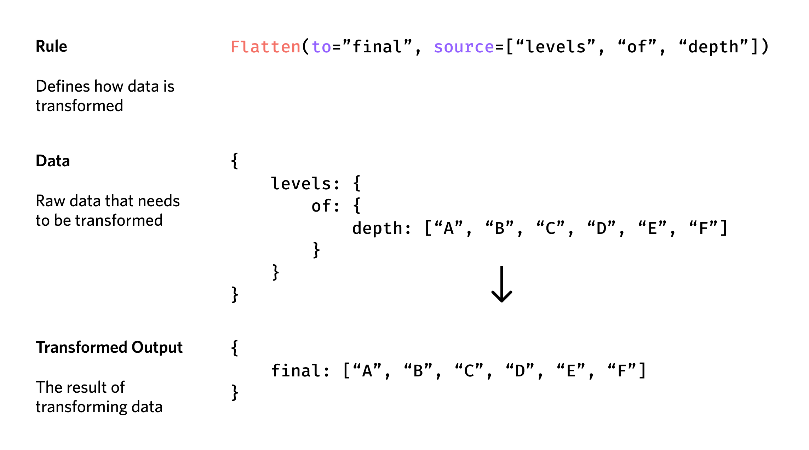
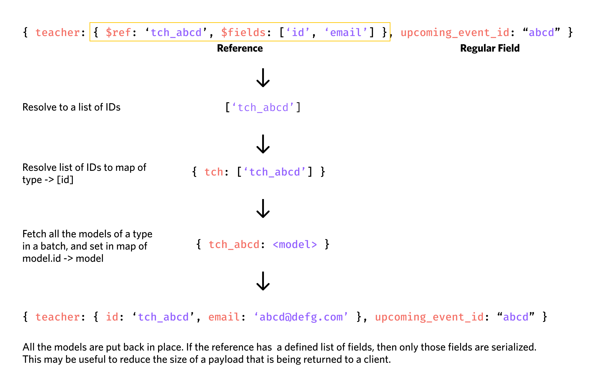

# tlda/api

The API that is used by both the CLI and UI to interact with the database. HTTP-based.

## Structure
- blueprints: Controllers that implement HTTP handlers for requests
- db: Models (`db/models`), connection handling and ID generation
    - resolve: A recursive function designed to resolve references to
      models in unstructured data (such as JSON objects). Used primarily
      in the upcoming events feature to allow unstructured data to reference
      entries within the database. Further explanation below.
- lib: Internal functions used by the application
    - error: Error handling, including HTTP errors and business logic errors.
    - validate: A validator written to validate unstructured (mostly JSON) data
      being passed by clients. Allows for primitives (int, str, float, bool, etc),
      complex types (array, date, enums), objects and discrimated unions (called
      `variants` in this code base), and models (db objects) to identify presence.

      Models are grouped by their type (thanks to the ID prefix), and then all checked
      at once to reduce DB load.
    - `dict.py` - An implementation of encoding a model from a set of "rules" - see below.

- middleware: Functions that are used to wrap HTTP handlers and implement common functions
  such as validation, authentication, etc.
- static: Files served under the API that are unlikely to change (currently only classrooms).

## Dependencies
- flask: HTTP server
- sqlalchemy: orm
- pyscopg2: psql client
- alembic: database migrations
- bcrypt: password hashing
- typing-extensions: necessary for certain features (e.g., Self) in codebase - used primarily to aid editor auto-completion

## Implementation Details

### Model Encoding

This application includes an method on SQLAlchemy models that encodes them to dictionaries - used when returning JSON objects. Multiple rules are implemented:
- `str`: Adds the value from the model stored at the given key to the resulting object.
- `Encode`: Encodes a db object (model) that is nested within the current model - accepts other resolvers allowing customisation of the resulting data.
- `Flatten`: Flattens an object at multiple nesting levels to a single key at the current level - useful when resolving relationships that are referenced by many objects (e.g., a grading system), but should really just flatten a single property into the current level (e.g., the grades for that system).

- `Map`: Takes a model and transforms it via the given function - useful within an `Encode` block (e.g., to combine two fields)
- `Iterate`: Iterates over many models (e.g., a `1->many` relationship of class -> students), applying the given encoders to each instance.
- `Place`: Allows you to place raw data into the encoded result - useful if you are calculating values outside of a model (such as when calculating statistical values for grades), and need to place it in the response.

With some alteration (likely moving from returning the response encoded to delegating to a decorator), we can infer the response types and produce accurate documentation produced from the source code - reducing the amount of developer time spent documenting changes.

### Resolving models from unstructured data

One of the difficulties in the application was resolving models from unstructured data - namely in "teacher reviews" and notifications. Differing types required resolving different models.

To resolve this, I wrote an algorithm that would recurse through the data and searched for objects that essentially "pointed" to a model within the database. Once it had found all references, it grouped them by ther ID type and resolved the relevant models.

This process was broken down into four steps:
- Finding all the IDs in the given object recursively
- Collecting them based on their ID to a map of id prefix to a list of IDs with that prefix
- Resolving the types, making `n` queries (where `n` is the number of unique types in the document)
- Placing the resolved data back into the original structure, leaving the rest of the object unchanged.

## Known Pitfalls

### Database - Resolving models from unstructured data

If the record being pointed to was removed from the database, any references that were pointing to it now point to a non-existent record - this violates the `consistency` clause of `ACID`.

As well as this, validation had to be carefully performed - if unstructured data was blindly accepted, and the attacker knew the required structure to make a valid reference, it could be possible to resolve models or fields that were not meant to be publicly available (e.g., a teacher's password). Two mitigations could be applied to this:
- Only allow resolving certain allowed types
- Marking fields on a model that can be encoded, preventing private fields from being exposed.

This vector was generally mitigated through validating inbound data - whilst unstructured data was stored in the database, the api server did not blindly insert unvalidated data into the database.

### Database - Model encoding

Some database queries are not very well optimised - namely in the `Encoder` in `api/db/dict.py`. When resolving data, it does so iteratively through each model not allowing the ORM to optimise this stage by loading data all at once - this could be optimised by looking over the rules and constructing preloads for the data, reducing the load on the database.

### Validation

Validation is likely not as efficient as it could be - nor does it provide strict typing once validation is complete. It is likely better to use another library (e.g., `pydantic`, `attrs`+`cattrs`) to handle validation but for the context of the project (a requirement for Computer Science subject), implementing my own validation handler was beneficial to demonstrate:
- Understanding of the requirements of validation
- Computational thinking
- Ability to test my own implementation, and produce relevant feedback on my own code.

Other validation modules use native code to achieve more efficient validation (e.g., `pydantic` uses `rust`, `msgpack` uses `c` respectively) - this would likely lead to perf improvements but for the given use-case of this application (likely a single deployment in the scope of a single school), this is fine. Any degredation in throughput can be accounted for by simply load balancing, which at this scale would likely result in little cost increase.
